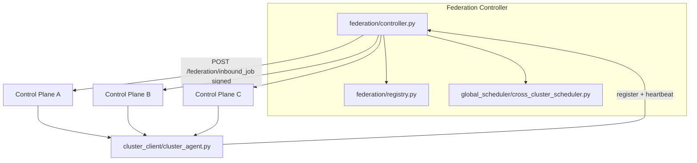

# Arsonist OS v8 / v9 / v10 / v11 - Self-Healing AI Cloud OS

Arsonist OS v8 is a mini distributed AI orchestration layer inspired by Kubernetes:

- Control plane schedules jobs and tracks cluster state.
- Worker nodes execute jobs in Docker sandboxes.
- Health monitor and autoscaler continuously heal and expand the cluster.
- Dashboard provides SaaS-style visibility and manual job submission.

## Project Layout

```text
arsonist-v8/
├── orchestrator/         # v11 runtime + deployments + rollouts
├── gpu/                  # v11 GPU discovery, VRAM, scheduling, metrics
├── models/               # v11 registry, cache, download, routing
├── inference/            # v11 OpenAI-compatible API + executors
├── containers/           # v11 sandbox profiles + image build helpers
├── scaling/              # v11 inference/GPU autoscaling hooks
├── telemetry/            # v11 inference + workload metrics
├── mesh/                 # v10 gossip + mesh routing + partitions + anti-entropy
├── distributed_queue/    # v10 mesh event log + replicated queue metadata
├── consensus/            # v10 optional raft / leases / distributed locks
├── edge/                 # v10 edge/offline helpers
├── observability/        # v10 mesh metrics + tracing hooks
├── federation/           # v9 federation controller modules (registry, routing, failover)
├── global_scheduler/     # v9 cross-cluster scheduler
├── cluster_client/       # v9 cluster ↔ federation agent
├── control_plane/
│   ├── app.py
│   ├── scheduler.py
│   ├── autoscaler.py
│   ├── discovery.py
│   ├── health.py
│   ├── nodes.py
│   ├── memory.py
│   ├── mesh_bootstrap.py
│   ├── mesh_routes.py
│   ├── v11_api.py
├── node/
│   └── agent.py
├── scheduler/
│   └── weighted.py
├── security/
│   └── hmac_auth.py
├── storage/
│   └── job_queue.py
├── dashboard/
│   ├── app.py
│   ├── templates/index.html
│   └── static/{app.js,styles.css}
├── sandbox/
│   └── docker_runner.py
├── shared/
│   ├── models.py
│   ├── ai_workloads.py
│   └── utils.py
├── tests/
│   ├── integration_sim.py
│   ├── federation_sim.py
│   ├── stress_test.py
│   ├── partition_sim.py
│   ├── mesh_failover_sim.py
│   ├── gossip_stress_test.py
│   ├── gpu_failover_sim.py
│   ├── inference_stress_test.py
│   └── deployment_sim.py
├── requirements.txt
└── README.md
```

## Job JSON Schema

```json
{
  "id": "uuid",
  "type": "ai | code | system | shell",
  "task": "string",
  "required_nodes": 1,
  "power": "low | medium | high",
  "gpu_required": true
}
```

## Run Instructions

1) Install dependencies:

```bash
python -m venv .venv
source .venv/bin/activate
pip install -r requirements.txt
```

2) Start control plane:

```bash
uvicorn control_plane.app:app --host 0.0.0.0 --port 8000
```

3) Start three nodes:

```bash
CONTROL_PLANE_URL=http://127.0.0.1:8000 PORT=9001 NODE_TYPE=GPU HAS_GPU=true python node/agent.py --port 9001 --node-type GPU --gpu
CONTROL_PLANE_URL=http://127.0.0.1:8000 PORT=9002 NODE_TYPE=CPU HAS_GPU=false python node/agent.py --port 9002 --node-type CPU
CONTROL_PLANE_URL=http://127.0.0.1:8000 PORT=9003 NODE_TYPE=EDGE HAS_GPU=false python node/agent.py --port 9003 --node-type EDGE
```

4) Start dashboard:

```bash
CONTROL_PLANE_URL=http://127.0.0.1:8000 python dashboard/app.py
```

Open `http://127.0.0.1:7000`.

## One-Command Docker Startup

From `arsonist-v8/`, start full cluster (control plane + 3 nodes + dashboard):

```bash
docker compose up --build
```

Then access:

- Control plane: `http://127.0.0.1:8000`
- Dashboard: `http://127.0.0.1:7000`

Stop:

```bash
docker compose down
```

## Makefile Shortcuts

From `arsonist-v8/`:

```bash
make up        # build + run full stack
make down      # stop stack
make logs      # follow service logs
make ps        # show service status
make restart   # restart services
make build     # build images
make test-sim  # run integration simulation script
```

## Submit a Job Manually

```bash
curl -X POST http://127.0.0.1:8000/submit_job \
  -H "Content-Type: application/json" \
  -d '{
    "type":"code",
    "task":"print(\"hello arsonist\")",
    "required_nodes":1,
    "power":"low",
    "gpu_required":false
  }'
```

## Local Cluster Simulation

Run full simulation (3 nodes, assignment, node failure, reassignment attempt, scaling):

```bash
python tests/integration_sim.py
```

## Autoscaling Behavior

Autoscaler checks:

- average cluster load > 0.75
- queue backlog >= 4 jobs
- GPU saturation > 0.80

When triggered, it requests a simulated new node and emits scaling events.

## v8.2 Distributed / security / intelligence

- **Coordinator / registry:** `ARSONIST_COORDINATOR_MODE=single|postgres|raft` — PostgreSQL advisory lock leadership (shared registry + job tables) removes scheduling SPOF when you run multiple control-plane replicas against one database. Optional Raft (`raft`) via pysyncobj when `ARSONIST_RAFT_SELF` / `ARSONIST_RAFT_PARTNERS` are set.
- **Persistent queue (PostgreSQL):** Set `ARSONIST_DATABASE_URL=postgresql://...` — jobs and queue use Postgres with `SKIP LOCKED` dequeue for HA; SQLite remains the default when unset.
- **Etcd-style KV:** `PUT/GET /registry/{key}` plus automatic heartbeat entries under `node:{id}`.
- **Node security:** Optional JWT (`ARSONIST_JWT_SECRET`) returned as `node_token` from `POST /register_node`; nodes send `X-Node-JWT`. HMAC request signing still supported. Optional HMAC of canonical job fields via `ARSONIST_JOB_SIGNING_KEY` on control plane and nodes (`arsonist_payload_sig` on dispatch).
- **Weighted scheduler:** Scores blend load, GPU fit, queue depth, **latency prediction** (RTT + load EMA), and **reliability history** (`jobs_completed_ok` / `jobs_failed`).
- **Predictive autoscaler:** Exponential smoothing on queue depth, load, and GPU saturation, plus short-horizon queue growth / velocity gates.
- **Discovery:** `ARSONIST_DISCOVERY_MODE=heartbeat|scan|both` (default `heartbeat`) — rely on registration + DB restore; LAN scan only when `scan` or `both`. Optional `ARSONIST_DISCOVERY_CIDR` / `ARSONIST_DISCOVERY_PORT`.

Health and metrics include `leader` when using an HA coordinator.

## v8.1 Upgrades

- Persistent job queue in SQLite with restart-safe reload
- Job states: `queued`, `running`, `completed`, `failed`
- Retry policy with max 3 attempts and per-job execution logs
- HMAC-signed node authentication (`NODE_SECRET`)
- Weighted scheduler (load + GPU + latency + queue depth)
- Heartbeat endpoint and dead-node lifecycle handling
- Job recovery + reassignment when nodes fail
- Metrics endpoints: `/metrics`, `/cluster/status`
- Dashboard auto-refresh every 3 seconds with live node/job views

## Reliability and Safety

- all outgoing requests use timeouts
- retries used during node registration and discovery probing
- failed nodes are removed by health monitor
- running jobs on failed nodes are re-queued
- execution sandbox uses `docker run --rm` for isolated, ephemeral job runtime

## Stress Testing

```bash
ARSONIST_API_TOKEN=change-me-token python tests/stress_test.py
```

---

## v9 — Federated Multi-Cluster AI Cloud

Single-cluster mode is unchanged: omit federation env vars and behavior stays local (v8-compatible APIs).

### Architecture



**Routing:** `submit_global_job` stores a row in the federation SQLite-backed global queue, runs `global_scheduler/cross_cluster_scheduler.py` to rank clusters (load, GPU capacity, queue depth, latency, region/health), picks the best cluster, then **pushes** the job with `httpx` to that cluster’s `/federation/inbound_job`. Original job id is preserved (`global_job_id`).

**Completion:** When a federated job finishes, the control plane calls `POST /global_job_complete` on the federation controller (see `control_plane/federation_callbacks.py`).

**Failover:** Background sweep (`federation/heartbeat.py`) marks clusters offline after heartbeat timeout; `federation/failover.py` reroutes assigned jobs to the next-best clusters and triggers push (same path as routing).

**Security:** Shared `ARSONIST_FEDERATION_SECRET` signs canonical JSON bodies on cluster → federation calls (`POST /register_cluster`, `POST /heartbeat`, `POST /global_job_complete`) and federation → cluster pushes (`POST /federation/inbound_job`). `X-Federation-Timestamp` must be within `FEDERATION_SIGNATURE_MAX_SKEW_SEC` (default 300s). Bearer `ARSONIST_FEDERATION_TOKEN` / `FEDERATION_API_TOKEN` protects federation read/write APIs used by operators and dashboards. When **no** shared secret is set, HMAC checks are skipped so local v8-style dev keeps working. Outbound HTTP uses timeouts (`httpx` / `requests`, typically 5s).

**Scheduler:** `preferred_region` on `POST /submit_global_job` adds a region affinity bonus in `global_scheduler/cross_cluster_scheduler.py` (same-region clusters score higher). Failover marks reassigned global jobs as `migrated` until completion.

**Persistence:** Global job queue and cluster rows live in federation SQLite (`FEDERATION_DB_PATH`) by default (restart-safe). For Redis/PostgreSQL-backed federation storage, follow the same pattern as the control plane’s `ARSONIST_DATABASE_URL` — swap the registry backing store in a future iteration if you outgrow single-node SQLite.

### Startup — federation controller only

```bash
export FEDERATION_API_TOKEN=change-fed-token
export ARSONIST_FEDERATION_SECRET=long-shared-hmac-secret
export FEDERATION_DB_PATH=data/federation.db
uvicorn federation.controller:app --host 0.0.0.0 --port 8500
```

### Startup — control plane with federation membership

Each cluster control plane (must reach federation URL):

```bash
export ARSONIST_API_TOKEN=cluster-token
export ARSONIST_CLUSTER_ID=cluster-west
export ARSONIST_CLUSTER_REGION=us-west
export ARSONIST_FEDERATION_URL=http://federation:8500
export ARSONIST_FEDERATION_TOKEN=change-fed-token
export ARSONIST_CONTROL_PLANE_PUBLIC_URL=http://control-plane-west:8000
export ARSONIST_FEDERATION_SECRET=long-shared-hmac-secret
uvicorn control_plane.app:app --host 0.0.0.0 --port 8000
```

The cluster agent (`cluster_client/cluster_agent.py`) registers and sends heartbeats automatically when `ARSONIST_CLUSTER_ID` and `ARSONIST_FEDERATION_URL` are set.

### Federation deployment flow

1. Deploy federation controller (single logical plane; scale reads/writes later via shared DB if you move registry to PostgreSQL).
2. Deploy each regional control plane with unique `ARSONIST_CLUSTER_ID`, matching `ARSONIST_FEDERATION_*` and shared HMAC secret.
3. Confirm `GET /clusters` on federation shows all regions.
4. Submit workloads via `POST /submit_global_job` on federation (or keep local `POST /submit_job` for purely local jobs).

### Multi-cluster simulation

```bash
make federation-sim
# optional: SIM_KILL=1 python tests/federation_sim.py
```

Spawns federation + three isolated control planes, registers them, submits a global job, prints routing and metrics.

### Failover test

1. Run `SIM_KILL=1 python tests/federation_sim.py` or stop one cluster container/process.
2. Wait longer than `FEDERATION_HEARTBEAT_TIMEOUT_SEC` (default 45s; simulation lowers this).
3. Observe `GET /federation_metrics` and `GET /routing_metrics` for `failover_events` / `failover_reroutes` and rerouted global jobs in the federation DB.

### Dashboard (federation views)

Set on the dashboard service:

- `ARSONIST_FEDERATION_DASHBOARD_URL` — federation base URL
- `ARSONIST_FEDERATION_DASHBOARD_TOKEN` — same bearer as `FEDERATION_API_TOKEN`

The UI adds **Global Overview / cluster cards / routing + failover** (polls every 3s with the local cluster view).

### Arsonist OS v10 — decentralized mesh (optional)

Enable peer gossip, mesh routing, replicated queue metadata, and mesh observability endpoints without removing federation.

**Modes (orthogonal):**

- **Standalone:** default — no federation env vars, `ARSONIST_MESH_ENABLED` unset.
- **Federation:** unchanged — set `ARSONIST_FEDERATION_URL` + `ARSONIST_CLUSTER_ID` as in v9.
- **Mesh:** set `ARSONIST_MESH_ENABLED=true` **or** `ARSONIST_ORCHESTRATION_MODE=mesh`, plus `ARSONIST_CLUSTER_ID` and `ARSONIST_CONTROL_PLANE_PUBLIC_URL`.

**Key environment variables:**

| Variable | Purpose |
| --- | --- |
| `ARSONIST_GOSSIP_INTERVAL` | Seconds between gossip rounds (default `4`) |
| `ARSONIST_PEER_TTL` | Seconds before expiring stale peers (default `120`) |
| `ARSONIST_GOSSIP_FANOUT` | Random peers contacted per round (default `3`) |
| `ARSONIST_MESH_SEED_URLS` | Comma-separated control plane URLs for cold start |
| `ARSONIST_MESH_HMAC_SECRET` | HMAC for mesh HTTP (falls back to federation secret) |
| `ARSONIST_MESH_TRUSTED_PEERS` | Optional comma allow-list of remote `cluster_id` values |
| `ARSONIST_CONSENSUS_MODE` | `disabled` (default), `raft`, or `leaderless` |
| `ARSONIST_RAFT_PARTNERS` | Comma addresses for `pysyncobj` when `raft` mode is enabled |

**Control plane HTTP (mesh):**

- `POST /mesh/gossip` — signed peer/state exchange
- `POST /mesh/forward_job` — async forward to best peer (`httpx`)
- `POST /mesh/receive_routed_job` — accept routed work from a peer
- `GET /mesh_metrics`, `GET /mesh_health`, `GET /mesh_routes` — observability
- `GET /mesh/peers`, `GET /mesh/events`, `POST /mesh/events/merge` — registry + event log

**Architecture (target shape):**

```text
        ┌──────────┐     gossip      ┌──────────┐
        │ Cluster A│◄──────────────►│ Cluster B│
        └────┬─────┘                 └────┬─────┘
             │   \                     /   │
             │    \   routed jobs    /    │
             ▼     ▼                 ▼     ▼
          Workers / queue replicas / edge buffers (SQLite sidecars by default)
```

**Simulations (from repo root):**

```bash
export PYTHONPATH=$PWD
python tests/partition_sim.py
python tests/mesh_failover_sim.py
python tests/gossip_stress_test.py
```

### Arsonist OS v11 — AI-native orchestration (optional)

Adds GPU discovery/scheduling, model registry, container runtime orchestration, OpenAI-compatible inference routes (`/v1/*`), deployment/rollout helpers, and telemetry endpoints — without removing v8 jobs, federation, or mesh.

**Enable AI orchestration features (autoscaler background threads):**

- `ARSONIST_AI_ORCHESTRATION_ENABLED=true` **or** `ARSONIST_ORCHESTRATION_MODE=ai` (also accepts `ai_native`, `v11`)

**Inference backend:**

- `OLLAMA_HOST` (default `http://127.0.0.1:11434`) for `/v1/chat/completions`, `/v1/embeddings`, `/v1/generate`

**Auth:**

- Same `ARSONIST_API_TOKEN` bearer as other admin APIs for metrics and model registry routes.
- Optional dedicated `ARSONIST_INFERENCE_API_TOKEN` for inference-only clients.
- JWT: set `ARSONIST_JWT_SECRET` and encode `scope` of `arsonist-inference` (or reuse node/admin scopes as implemented in `security/inference_auth.py`).
- If **no** API token and **no** JWT secret are configured, inference auth is relaxed for local dev only.

**Notable HTTP routes:**

- `POST /v1/chat/completions`, `POST /v1/embeddings`, `POST /v1/generate`
- `GET /inference_metrics`, `GET /gpu_metrics`, `GET /deployment_metrics`
- `POST /v11/models/register`, `GET /v11/models/search?q=...`
- `POST /v11/deployments`, `POST /v11/rollouts`

**Simulations:**

```bash
export PYTHONPATH=$PWD
python tests/gpu_failover_sim.py
python tests/inference_stress_test.py
python tests/deployment_sim.py
```

### Scaling

- **Horizontal:** Add clusters with new `ARSONIST_CLUSTER_ID`; they self-register and enter the global scheduler pool.
- **Load:** Global queue and metrics live in `FEDERATION_DB_PATH` (SQLite by default). For very high throughput, point a future registry at PostgreSQL (same pattern as `ARSONIST_DATABASE_URL` for the control plane).
- **Scheduler budget:** Cross-cluster decisions are designed to stay under 500ms (in-process scoring only; network push is async and timed out separately).

---

### Arsonist OS v13 — Global AI Compute Fabric

Extends the platform from a hosted AI cloud into a **globally distributed AI compute fabric** with multi-region orchestration, global inference routing, edge + cloud execution, worldwide workload placement, and active-active regional infrastructure.

**Modes (additive — all prior modes still work):**

- **Standalone:** unchanged.
- **Federation:** unchanged.
- **Mesh:** unchanged.
- **Global Fabric:** set `ARSONIST_FABRIC_MODE=global` to enable v13 global region management, routing, replication, and failover.

#### New Modules

```text
regions/                  # Global region management
├── region_registry.py    # Region registration, heartbeat, status tracking
├── region_health.py      # Regional health monitoring with heartbeat timeout
├── geo_routing.py        # Geographic routing (nearest-region, geo-fenced)
├── regional_capacity.py  # Per-region capacity tracking and saturation
├── latency_map.py        # Inter-region and client latency measurement

global_control/           # Global control plane extensions
├── global_control_plane.py  # Top-level global orchestration coordinator
├── consensus.py          # Lightweight leader election / consensus
├── replication.py        # Incremental state replication with conflict resolution
├── global_state.py       # Global state store (SQLite-backed)

routing/                  # Global latency-aware routing
├── global_router.py      # Multi-factor inference routing (latency, load, GPU, queue)
├── latency_router.py     # Pure latency-based routing
├── smart_failover.py     # Automatic regional failover with transparent rerouting
├── request_affinity.py   # Session/model/client affinity for request stickiness

replication/              # Distributed replication
├── model_replication.py  # Automatic model replication across regions (hot/warm/cold)
├── state_replication.py  # Incremental state replication with checkpointing
├── cache_replication.py  # Distributed cache with regional invalidation and warming

fabric/                   # Global compute fabric
├── compute_fabric.py     # Top-level abstraction over global compute mesh
├── placement_engine.py   # Multi-factor workload placement (GPU, latency, cost)
├── topology_manager.py   # Global topology graph with shortest-path routing

edge/                     # Edge AI extensions
├── edge_runtime.py       # Lightweight edge inference with offline support
├── edge_scheduler.py     # Edge workload scheduling with priority queuing
├── edge_cache.py         # Local LRU inference cache for edge nodes

networking/               # Overlay network layer
├── overlay_network.py    # Encrypted inter-region overlay with service discovery
├── encrypted_transport.py  # Mutual auth and encrypted transport (mTLS-ready)
├── bandwidth_optimizer.py  # Bandwidth-aware routing and transfer scheduling

telemetry/                # Global observability extensions
├── global_metrics.py     # Fabric-wide metrics (request flow, latency, replication)
├── regional_metrics.py   # Per-region metrics collection and aggregation
├── routing_metrics.py    # Routing decision and failover metrics

dashboard/
├── fabric_panel.py       # v13 fabric visualization endpoints

tests/
├── multi_region_sim.py        # Full multi-region simulation
├── regional_failover_test.py  # Failover scenario tests
├── edge_disconnect_test.py    # Edge disconnect/reconnect tests
```

#### Key Environment Variables

| Variable | Purpose |
| --- | --- |
| `ARSONIST_FABRIC_MODE` | `global` to enable v13 fabric features |
| `ARSONIST_REGION_DB_PATH` | Region registry SQLite path (default `data/regions.db`) |
| `ARSONIST_REPLICATION_DB` | Model replication SQLite path (default `data/model_replication.db`) |
| `ARSONIST_EDGE_RUNTIME_DB` | Edge runtime SQLite path (per-node) |
| `ARSONIST_GLOBAL_STATE_DB` | Global state SQLite path (default `data/global_state.db`) |

#### Global Routing

Inference requests are routed based on multi-factor scoring:

- **Client latency** (30%): Prefer regions closest to the client
- **Regional load** (25%): Avoid saturated regions
- **GPU availability** (20%): Prefer regions with available GPU/VRAM
- **Queue depth** (15%): Avoid regions with deep queues
- **Bandwidth** (10%): Prefer high-bandwidth paths

Supported strategies: `nearest`, `weighted`, `least_loaded`, `gpu_affinity`, `round_robin`.

#### Active-Active Failover

Automatic failover triggers on:
- Latency spikes (>1000ms threshold)
- Region outages (offline status)
- GPU exhaustion (>95% saturation)
- Network partitions
- Deployment failures

Failover transparently reroutes requests to the next-best region with workload migration and traffic draining.

#### Edge AI Execution

Edge nodes support:
- Intermittent connectivity with offline operation
- Local inference caching (LRU eviction)
- Outbox-based synchronization on reconnect
- Priority-based edge workload scheduling

#### Model Replication

Models replicate automatically across regions with three tiers:
- **Hot:** High-frequency models, always ready
- **Warm:** Medium-frequency, loaded on demand
- **Cold:** Archived, restored when needed

#### Overlay Network

Encrypted inter-region communication with:
- Service discovery and connection pooling
- Mutual authentication and request signing
- Bandwidth-aware routing and transfer optimization
- Support for TCP, QUIC, and WireGuard transport

#### Dashboard (v13 fabric views)

The dashboard exposes fabric visualization endpoints under `/api/v13/fabric/`:

- `overview` — Global metrics summary
- `regions` / `regions/<id>` — Region details
- `topology` — Network topology graph
- `routing` — Routing decisions and metrics
- `replication` — Model replication status
- `edge` — Edge node health
- `failover` — Failover events and metrics
- `latency_map` — Cross-region latency matrix
- `gpu_utilization` — Per-region GPU usage
- `cache` — Distributed cache metrics
- `network` — Overlay network and bandwidth
- `workloads` — Active workload placement
- `world_map` — Combined view for map visualization

#### v13 Simulations

```bash
export PYTHONPATH=$PWD

# Full multi-region simulation (routing, replication, placement, outage, failover, cache, partition)
python tests/multi_region_sim.py

# Regional failover tests (basic, recovery, latency spike, GPU exhaustion, cascading, migration)
python tests/regional_failover_test.py

# Edge disconnect tests (online, offline, reconnect, scheduler failure, cache eviction)
python tests/edge_disconnect_test.py
```

#### Backward Compatibility

v13 does **not** break any existing APIs or modes:

- v8 standalone clusters work unchanged
- v9 federation mode works unchanged
- v10 mesh mode works unchanged
- v11 AI orchestration works unchanged
- v12 multi-tenant cloud works unchanged

All v13 features are additive and activated via new configuration.
