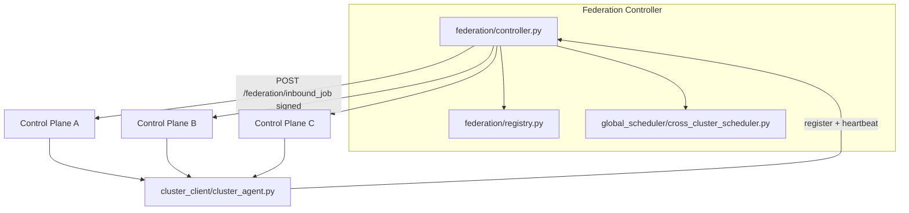

# Arsonist OS v8 - Self-Healing AI Cloud OS

Arsonist OS v8 is a mini distributed AI orchestration layer inspired by Kubernetes:

- Control plane schedules jobs and tracks cluster state.
- Worker nodes execute jobs in Docker sandboxes.
- Health monitor and autoscaler continuously heal and expand the cluster.
- Dashboard provides SaaS-style visibility and manual job submission.

## Project Layout

```text
arsonist-v8/
├── federation/           # v9 federation controller modules (registry, routing, failover)
├── global_scheduler/     # v9 cross-cluster scheduler
├── cluster_client/       # v9 cluster ↔ federation agent
├── control_plane/
│   ├── app.py
│   ├── scheduler.py
│   ├── autoscaler.py
│   ├── discovery.py
│   ├── health.py
│   ├── nodes.py
│   ├── memory.py
├── node/
│   └── agent.py
├── scheduler/
│   └── weighted.py
├── security/
│   └── hmac_auth.py
├── storage/
│   └── job_queue.py
├── dashboard/
│   ├── app.py
│   ├── templates/index.html
│   └── static/{app.js,styles.css}
├── sandbox/
│   └── docker_runner.py
├── shared/
│   ├── models.py
│   └── utils.py
├── tests/
│   ├── integration_sim.py
│   └── stress_test.py
├── requirements.txt
└── README.md
```

## Job JSON Schema

```json
{
  "id": "uuid",
  "type": "ai | code | system | shell",
  "task": "string",
  "required_nodes": 1,
  "power": "low | medium | high",
  "gpu_required": true
}
```

## Run Instructions

1) Install dependencies:

```bash
python -m venv .venv
source .venv/bin/activate
pip install -r requirements.txt
```

2) Start control plane:

```bash
uvicorn control_plane.app:app --host 0.0.0.0 --port 8000
```

3) Start three nodes:

```bash
CONTROL_PLANE_URL=http://127.0.0.1:8000 PORT=9001 NODE_TYPE=GPU HAS_GPU=true python node/agent.py --port 9001 --node-type GPU --gpu
CONTROL_PLANE_URL=http://127.0.0.1:8000 PORT=9002 NODE_TYPE=CPU HAS_GPU=false python node/agent.py --port 9002 --node-type CPU
CONTROL_PLANE_URL=http://127.0.0.1:8000 PORT=9003 NODE_TYPE=EDGE HAS_GPU=false python node/agent.py --port 9003 --node-type EDGE
```

4) Start dashboard:

```bash
CONTROL_PLANE_URL=http://127.0.0.1:8000 python dashboard/app.py
```

Open `http://127.0.0.1:7000`.

## One-Command Docker Startup

From `arsonist-v8/`, start full cluster (control plane + 3 nodes + dashboard):

```bash
docker compose up --build
```

Then access:

- Control plane: `http://127.0.0.1:8000`
- Dashboard: `http://127.0.0.1:7000`

Stop:

```bash
docker compose down
```

## Makefile Shortcuts

From `arsonist-v8/`:

```bash
make up        # build + run full stack
make down      # stop stack
make logs      # follow service logs
make ps        # show service status
make restart   # restart services
make build     # build images
make test-sim  # run integration simulation script
```

## Submit a Job Manually

```bash
curl -X POST http://127.0.0.1:8000/submit_job \
  -H "Content-Type: application/json" \
  -d '{
    "type":"code",
    "task":"print(\"hello arsonist\")",
    "required_nodes":1,
    "power":"low",
    "gpu_required":false
  }'
```

## Local Cluster Simulation

Run full simulation (3 nodes, assignment, node failure, reassignment attempt, scaling):

```bash
python tests/integration_sim.py
```

## Autoscaling Behavior

Autoscaler checks:

- average cluster load > 0.75
- queue backlog >= 4 jobs
- GPU saturation > 0.80

When triggered, it requests a simulated new node and emits scaling events.

## v8.2 Distributed / security / intelligence

- **Coordinator / registry:** `ARSONIST_COORDINATOR_MODE=single|postgres|raft` — PostgreSQL advisory lock leadership (shared registry + job tables) removes scheduling SPOF when you run multiple control-plane replicas against one database. Optional Raft (`raft`) via pysyncobj when `ARSONIST_RAFT_SELF` / `ARSONIST_RAFT_PARTNERS` are set.
- **Persistent queue (PostgreSQL):** Set `ARSONIST_DATABASE_URL=postgresql://...` — jobs and queue use Postgres with `SKIP LOCKED` dequeue for HA; SQLite remains the default when unset.
- **Etcd-style KV:** `PUT/GET /registry/{key}` plus automatic heartbeat entries under `node:{id}`.
- **Node security:** Optional JWT (`ARSONIST_JWT_SECRET`) returned as `node_token` from `POST /register_node`; nodes send `X-Node-JWT`. HMAC request signing still supported. Optional HMAC of canonical job fields via `ARSONIST_JOB_SIGNING_KEY` on control plane and nodes (`arsonist_payload_sig` on dispatch).
- **Weighted scheduler:** Scores blend load, GPU fit, queue depth, **latency prediction** (RTT + load EMA), and **reliability history** (`jobs_completed_ok` / `jobs_failed`).
- **Predictive autoscaler:** Exponential smoothing on queue depth, load, and GPU saturation, plus short-horizon queue growth / velocity gates.
- **Discovery:** `ARSONIST_DISCOVERY_MODE=heartbeat|scan|both` (default `heartbeat`) — rely on registration + DB restore; LAN scan only when `scan` or `both`. Optional `ARSONIST_DISCOVERY_CIDR` / `ARSONIST_DISCOVERY_PORT`.

Health and metrics include `leader` when using an HA coordinator.

## v8.1 Upgrades

- Persistent job queue in SQLite with restart-safe reload
- Job states: `queued`, `running`, `completed`, `failed`
- Retry policy with max 3 attempts and per-job execution logs
- HMAC-signed node authentication (`NODE_SECRET`)
- Weighted scheduler (load + GPU + latency + queue depth)
- Heartbeat endpoint and dead-node lifecycle handling
- Job recovery + reassignment when nodes fail
- Metrics endpoints: `/metrics`, `/cluster/status`
- Dashboard auto-refresh every 3 seconds with live node/job views

## Reliability and Safety

- all outgoing requests use timeouts
- retries used during node registration and discovery probing
- failed nodes are removed by health monitor
- running jobs on failed nodes are re-queued
- execution sandbox uses `docker run --rm` for isolated, ephemeral job runtime

## Stress Testing

```bash
ARSONIST_API_TOKEN=change-me-token python tests/stress_test.py
```

---

## v9 — Federated Multi-Cluster AI Cloud

Single-cluster mode is unchanged: omit federation env vars and behavior stays local (v8-compatible APIs).

### Architecture



**Routing:** `submit_global_job` stores a row in the federation SQLite-backed global queue, runs `global_scheduler/cross_cluster_scheduler.py` to rank clusters (load, GPU capacity, queue depth, latency, region/health), picks the best cluster, then **pushes** the job with `httpx` to that cluster’s `/federation/inbound_job`. Original job id is preserved (`global_job_id`).

**Completion:** When a federated job finishes, the control plane calls `POST /global_job_complete` on the federation controller (see `control_plane/federation_callbacks.py`).

**Failover:** Background sweep (`federation/heartbeat.py`) marks clusters offline after heartbeat timeout; `federation/failover.py` reroutes assigned jobs to the next-best clusters and triggers push (same path as routing).

**Security:** Shared `ARSONIST_FEDERATION_SECRET` signs canonical JSON bodies on cluster → federation calls (`POST /register_cluster`, `POST /heartbeat`, `POST /global_job_complete`) and federation → cluster pushes (`POST /federation/inbound_job`). `X-Federation-Timestamp` must be within `FEDERATION_SIGNATURE_MAX_SKEW_SEC` (default 300s). Bearer `ARSONIST_FEDERATION_TOKEN` / `FEDERATION_API_TOKEN` protects federation read/write APIs used by operators and dashboards. When **no** shared secret is set, HMAC checks are skipped so local v8-style dev keeps working. Outbound HTTP uses timeouts (`httpx` / `requests`, typically 5s).

**Scheduler:** `preferred_region` on `POST /submit_global_job` adds a region affinity bonus in `global_scheduler/cross_cluster_scheduler.py` (same-region clusters score higher). Failover marks reassigned global jobs as `migrated` until completion.

**Persistence:** Global job queue and cluster rows live in federation SQLite (`FEDERATION_DB_PATH`) by default (restart-safe). For Redis/PostgreSQL-backed federation storage, follow the same pattern as the control plane’s `ARSONIST_DATABASE_URL` — swap the registry backing store in a future iteration if you outgrow single-node SQLite.

### Startup — federation controller only

```bash
export FEDERATION_API_TOKEN=change-fed-token
export ARSONIST_FEDERATION_SECRET=long-shared-hmac-secret
export FEDERATION_DB_PATH=data/federation.db
uvicorn federation.controller:app --host 0.0.0.0 --port 8500
```

### Startup — control plane with federation membership

Each cluster control plane (must reach federation URL):

```bash
export ARSONIST_API_TOKEN=cluster-token
export ARSONIST_CLUSTER_ID=cluster-west
export ARSONIST_CLUSTER_REGION=us-west
export ARSONIST_FEDERATION_URL=http://federation:8500
export ARSONIST_FEDERATION_TOKEN=change-fed-token
export ARSONIST_CONTROL_PLANE_PUBLIC_URL=http://control-plane-west:8000
export ARSONIST_FEDERATION_SECRET=long-shared-hmac-secret
uvicorn control_plane.app:app --host 0.0.0.0 --port 8000
```

The cluster agent (`cluster_client/cluster_agent.py`) registers and sends heartbeats automatically when `ARSONIST_CLUSTER_ID` and `ARSONIST_FEDERATION_URL` are set.

### Federation deployment flow

1. Deploy federation controller (single logical plane; scale reads/writes later via shared DB if you move registry to PostgreSQL).
2. Deploy each regional control plane with unique `ARSONIST_CLUSTER_ID`, matching `ARSONIST_FEDERATION_*` and shared HMAC secret.
3. Confirm `GET /clusters` on federation shows all regions.
4. Submit workloads via `POST /submit_global_job` on federation (or keep local `POST /submit_job` for purely local jobs).

### Multi-cluster simulation

```bash
make federation-sim
# optional: SIM_KILL=1 python tests/federation_sim.py
```

Spawns federation + three isolated control planes, registers them, submits a global job, prints routing and metrics.

### Failover test

1. Run `SIM_KILL=1 python tests/federation_sim.py` or stop one cluster container/process.
2. Wait longer than `FEDERATION_HEARTBEAT_TIMEOUT_SEC` (default 45s; simulation lowers this).
3. Observe `GET /federation_metrics` and `GET /routing_metrics` for `failover_events` / `failover_reroutes` and rerouted global jobs in the federation DB.

### Dashboard (federation views)

Set on the dashboard service:

- `ARSONIST_FEDERATION_DASHBOARD_URL` — federation base URL
- `ARSONIST_FEDERATION_DASHBOARD_TOKEN` — same bearer as `FEDERATION_API_TOKEN`

The UI adds **Global Overview / cluster cards / routing + failover** (polls every 3s with the local cluster view).

### Scaling

- **Horizontal:** Add clusters with new `ARSONIST_CLUSTER_ID`; they self-register and enter the global scheduler pool.
- **Load:** Global queue and metrics live in `FEDERATION_DB_PATH` (SQLite by default). For very high throughput, point a future registry at PostgreSQL (same pattern as `ARSONIST_DATABASE_URL` for the control plane).
- **Scheduler budget:** Cross-cluster decisions are designed to stay under 500ms (in-process scoring only; network push is async and timed out separately).
