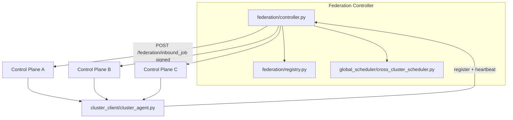

# Arsonist OS v8 / v9 / v10 / v11 - Self-Healing AI Cloud OS

Arsonist OS v8 is a mini distributed AI orchestration layer inspired by Kubernetes:

- Control plane schedules jobs and tracks cluster state.
- Worker nodes execute jobs in Docker sandboxes.
- Health monitor and autoscaler continuously heal and expand the cluster.
- Dashboard provides SaaS-style visibility and manual job submission.

## Project Layout

```text
arsonist-v8/
├── orchestrator/         # v11 runtime + deployments + rollouts
├── gpu/                  # v11 GPU discovery, VRAM, scheduling, metrics
├── models/               # v11 registry, cache, download, routing
├── inference/            # v11 OpenAI-compatible API + executors
├── containers/           # v11 sandbox profiles + image build helpers
├── scaling/              # v11 inference/GPU autoscaling hooks
├── telemetry/            # v11 inference + workload metrics
├── mesh/                 # v10 gossip + mesh routing + partitions + anti-entropy
├── distributed_queue/    # v10 mesh event log + replicated queue metadata
├── consensus/            # v10 optional raft / leases / distributed locks
├── edge/                 # v10 edge/offline helpers
├── observability/        # v10 mesh metrics + tracing hooks
├── federation/           # v9 federation controller modules (registry, routing, failover)
├── global_scheduler/     # v9 cross-cluster scheduler
├── cluster_client/       # v9 cluster ↔ federation agent
├── control_plane/
│   ├── app.py
│   ├── scheduler.py
│   ├── autoscaler.py
│   ├── discovery.py
│   ├── health.py
│   ├── nodes.py
│   ├── memory.py
│   ├── mesh_bootstrap.py
│   ├── mesh_routes.py
│   ├── v11_api.py
├── node/
│   └── agent.py
├── scheduler/
│   └── weighted.py
├── security/
│   └── hmac_auth.py
├── storage/
│   └── job_queue.py
├── dashboard/
│   ├── app.py
│   ├── templates/index.html
│   └── static/{app.js,styles.css}
├── sandbox/
│   └── docker_runner.py
├── shared/
│   ├── models.py
│   ├── ai_workloads.py
│   └── utils.py
├── tests/
│   ├── integration_sim.py
│   ├── federation_sim.py
│   ├── stress_test.py
│   ├── partition_sim.py
│   ├── mesh_failover_sim.py
│   ├── gossip_stress_test.py
│   ├── gpu_failover_sim.py
│   ├── inference_stress_test.py
│   └── deployment_sim.py
├── requirements.txt
└── README.md
```

## Job JSON Schema

```json
{
  "id": "uuid",
  "type": "ai | code | system | shell",
  "task": "string",
  "required_nodes": 1,
  "power": "low | medium | high",
  "gpu_required": true
}
```

## Run Instructions

1) Install dependencies:

```bash
python -m venv .venv
source .venv/bin/activate
pip install -r requirements.txt
```

2) Start control plane:

```bash
uvicorn control_plane.app:app --host 0.0.0.0 --port 8000
```

3) Start three nodes:

```bash
CONTROL_PLANE_URL=http://127.0.0.1:8000 PORT=9001 NODE_TYPE=GPU HAS_GPU=true python node/agent.py --port 9001 --node-type GPU --gpu
CONTROL_PLANE_URL=http://127.0.0.1:8000 PORT=9002 NODE_TYPE=CPU HAS_GPU=false python node/agent.py --port 9002 --node-type CPU
CONTROL_PLANE_URL=http://127.0.0.1:8000 PORT=9003 NODE_TYPE=EDGE HAS_GPU=false python node/agent.py --port 9003 --node-type EDGE
```

4) Start dashboard:

```bash
CONTROL_PLANE_URL=http://127.0.0.1:8000 python dashboard/app.py
```

Open `http://127.0.0.1:7000`.

## One-Command Docker Startup

From `arsonist-v8/`, start full cluster (control plane + 3 nodes + dashboard):

```bash
docker compose up --build
```

Then access:

- Control plane: `http://127.0.0.1:8000`
- Dashboard: `http://127.0.0.1:7000`

Stop:

```bash
docker compose down
```

## Makefile Shortcuts

From `arsonist-v8/`:

```bash
make up        # build + run full stack
make down      # stop stack
make logs      # follow service logs
make ps        # show service status
make restart   # restart services
make build     # build images
make test-sim  # run integration simulation script
```

## Submit a Job Manually

```bash
curl -X POST http://127.0.0.1:8000/submit_job \
  -H "Content-Type: application/json" \
  -d '{
    "type":"code",
    "task":"print(\"hello arsonist\")",
    "required_nodes":1,
    "power":"low",
    "gpu_required":false
  }'
```

## Local Cluster Simulation

Run full simulation (3 nodes, assignment, node failure, reassignment attempt, scaling):

```bash
python tests/integration_sim.py
```

## Autoscaling Behavior

Autoscaler checks:

- average cluster load > 0.75
- queue backlog >= 4 jobs
- GPU saturation > 0.80

When triggered, it requests a simulated new node and emits scaling events.

## v8.2 Distributed / security / intelligence

- **Coordinator / registry:** `ARSONIST_COORDINATOR_MODE=single|postgres|raft` — PostgreSQL advisory lock leadership (shared registry + job tables) removes scheduling SPOF when you run multiple control-plane replicas against one database. Optional Raft (`raft`) via pysyncobj when `ARSONIST_RAFT_SELF` / `ARSONIST_RAFT_PARTNERS` are set.
- **Persistent queue (PostgreSQL):** Set `ARSONIST_DATABASE_URL=postgresql://...` — jobs and queue use Postgres with `SKIP LOCKED` dequeue for HA; SQLite remains the default when unset.
- **Etcd-style KV:** `PUT/GET /registry/{key}` plus automatic heartbeat entries under `node:{id}`.
- **Node security:** Optional JWT (`ARSONIST_JWT_SECRET`) returned as `node_token` from `POST /register_node`; nodes send `X-Node-JWT`. HMAC request signing still supported. Optional HMAC of canonical job fields via `ARSONIST_JOB_SIGNING_KEY` on control plane and nodes (`arsonist_payload_sig` on dispatch).
- **Weighted scheduler:** Scores blend load, GPU fit, queue depth, **latency prediction** (RTT + load EMA), and **reliability history** (`jobs_completed_ok` / `jobs_failed`).
- **Predictive autoscaler:** Exponential smoothing on queue depth, load, and GPU saturation, plus short-horizon queue growth / velocity gates.
- **Discovery:** `ARSONIST_DISCOVERY_MODE=heartbeat|scan|both` (default `heartbeat`) — rely on registration + DB restore; LAN scan only when `scan` or `both`. Optional `ARSONIST_DISCOVERY_CIDR` / `ARSONIST_DISCOVERY_PORT`.

Health and metrics include `leader` when using an HA coordinator.

## v8.1 Upgrades

- Persistent job queue in SQLite with restart-safe reload
- Job states: `queued`, `running`, `completed`, `failed`
- Retry policy with max 3 attempts and per-job execution logs
- HMAC-signed node authentication (`NODE_SECRET`)
- Weighted scheduler (load + GPU + latency + queue depth)
- Heartbeat endpoint and dead-node lifecycle handling
- Job recovery + reassignment when nodes fail
- Metrics endpoints: `/metrics`, `/cluster/status`
- Dashboard auto-refresh every 3 seconds with live node/job views

## Reliability and Safety

- all outgoing requests use timeouts
- retries used during node registration and discovery probing
- failed nodes are removed by health monitor
- running jobs on failed nodes are re-queued
- execution sandbox uses `docker run --rm` for isolated, ephemeral job runtime

## Stress Testing

```bash
ARSONIST_API_TOKEN=change-me-token python tests/stress_test.py
```

---

## v9 — Federated Multi-Cluster AI Cloud

Single-cluster mode is unchanged: omit federation env vars and behavior stays local (v8-compatible APIs).

### Architecture



**Routing:** `submit_global_job` stores a row in the federation SQLite-backed global queue, runs `global_scheduler/cross_cluster_scheduler.py` to rank clusters (load, GPU capacity, queue depth, latency, region/health), picks the best cluster, then **pushes** the job with `httpx` to that cluster’s `/federation/inbound_job`. Original job id is preserved (`global_job_id`).

**Completion:** When a federated job finishes, the control plane calls `POST /global_job_complete` on the federation controller (see `control_plane/federation_callbacks.py`).

**Failover:** Background sweep (`federation/heartbeat.py`) marks clusters offline after heartbeat timeout; `federation/failover.py` reroutes assigned jobs to the next-best clusters and triggers push (same path as routing).

**Security:** Shared `ARSONIST_FEDERATION_SECRET` signs canonical JSON bodies on cluster → federation calls (`POST /register_cluster`, `POST /heartbeat`, `POST /global_job_complete`) and federation → cluster pushes (`POST /federation/inbound_job`). `X-Federation-Timestamp` must be within `FEDERATION_SIGNATURE_MAX_SKEW_SEC` (default 300s). Bearer `ARSONIST_FEDERATION_TOKEN` / `FEDERATION_API_TOKEN` protects federation read/write APIs used by operators and dashboards. When **no** shared secret is set, HMAC checks are skipped so local v8-style dev keeps working. Outbound HTTP uses timeouts (`httpx` / `requests`, typically 5s).

**Scheduler:** `preferred_region` on `POST /submit_global_job` adds a region affinity bonus in `global_scheduler/cross_cluster_scheduler.py` (same-region clusters score higher). Failover marks reassigned global jobs as `migrated` until completion.

**Persistence:** Global job queue and cluster rows live in federation SQLite (`FEDERATION_DB_PATH`) by default (restart-safe). For Redis/PostgreSQL-backed federation storage, follow the same pattern as the control plane’s `ARSONIST_DATABASE_URL` — swap the registry backing store in a future iteration if you outgrow single-node SQLite.

### Startup — federation controller only

```bash
export FEDERATION_API_TOKEN=change-fed-token
export ARSONIST_FEDERATION_SECRET=long-shared-hmac-secret
export FEDERATION_DB_PATH=data/federation.db
uvicorn federation.controller:app --host 0.0.0.0 --port 8500
```

### Startup — control plane with federation membership

Each cluster control plane (must reach federation URL):

```bash
export ARSONIST_API_TOKEN=cluster-token
export ARSONIST_CLUSTER_ID=cluster-west
export ARSONIST_CLUSTER_REGION=us-west
export ARSONIST_FEDERATION_URL=http://federation:8500
export ARSONIST_FEDERATION_TOKEN=change-fed-token
export ARSONIST_CONTROL_PLANE_PUBLIC_URL=http://control-plane-west:8000
export ARSONIST_FEDERATION_SECRET=long-shared-hmac-secret
uvicorn control_plane.app:app --host 0.0.0.0 --port 8000
```

The cluster agent (`cluster_client/cluster_agent.py`) registers and sends heartbeats automatically when `ARSONIST_CLUSTER_ID` and `ARSONIST_FEDERATION_URL` are set.

### Federation deployment flow

1. Deploy federation controller (single logical plane; scale reads/writes later via shared DB if you move registry to PostgreSQL).
2. Deploy each regional control plane with unique `ARSONIST_CLUSTER_ID`, matching `ARSONIST_FEDERATION_*` and shared HMAC secret.
3. Confirm `GET /clusters` on federation shows all regions.
4. Submit workloads via `POST /submit_global_job` on federation (or keep local `POST /submit_job` for purely local jobs).

### Multi-cluster simulation

```bash
make federation-sim
# optional: SIM_KILL=1 python tests/federation_sim.py
```

Spawns federation + three isolated control planes, registers them, submits a global job, prints routing and metrics.

### Failover test

1. Run `SIM_KILL=1 python tests/federation_sim.py` or stop one cluster container/process.
2. Wait longer than `FEDERATION_HEARTBEAT_TIMEOUT_SEC` (default 45s; simulation lowers this).
3. Observe `GET /federation_metrics` and `GET /routing_metrics` for `failover_events` / `failover_reroutes` and rerouted global jobs in the federation DB.

### Dashboard (federation views)

Set on the dashboard service:

- `ARSONIST_FEDERATION_DASHBOARD_URL` — federation base URL
- `ARSONIST_FEDERATION_DASHBOARD_TOKEN` — same bearer as `FEDERATION_API_TOKEN`

The UI adds **Global Overview / cluster cards / routing + failover** (polls every 3s with the local cluster view).

### Arsonist OS v10 — decentralized mesh (optional)

Enable peer gossip, mesh routing, replicated queue metadata, and mesh observability endpoints without removing federation.

**Modes (orthogonal):**

- **Standalone:** default — no federation env vars, `ARSONIST_MESH_ENABLED` unset.
- **Federation:** unchanged — set `ARSONIST_FEDERATION_URL` + `ARSONIST_CLUSTER_ID` as in v9.
- **Mesh:** set `ARSONIST_MESH_ENABLED=true` **or** `ARSONIST_ORCHESTRATION_MODE=mesh`, plus `ARSONIST_CLUSTER_ID` and `ARSONIST_CONTROL_PLANE_PUBLIC_URL`.

**Key environment variables:**

| Variable | Purpose |
| --- | --- |
| `ARSONIST_GOSSIP_INTERVAL` | Seconds between gossip rounds (default `4`) |
| `ARSONIST_PEER_TTL` | Seconds before expiring stale peers (default `120`) |
| `ARSONIST_GOSSIP_FANOUT` | Random peers contacted per round (default `3`) |
| `ARSONIST_MESH_SEED_URLS` | Comma-separated control plane URLs for cold start |
| `ARSONIST_MESH_HMAC_SECRET` | HMAC for mesh HTTP (falls back to federation secret) |
| `ARSONIST_MESH_TRUSTED_PEERS` | Optional comma allow-list of remote `cluster_id` values |
| `ARSONIST_CONSENSUS_MODE` | `disabled` (default), `raft`, or `leaderless` |
| `ARSONIST_RAFT_PARTNERS` | Comma addresses for `pysyncobj` when `raft` mode is enabled |

**Control plane HTTP (mesh):**

- `POST /mesh/gossip` — signed peer/state exchange
- `POST /mesh/forward_job` — async forward to best peer (`httpx`)
- `POST /mesh/receive_routed_job` — accept routed work from a peer
- `GET /mesh_metrics`, `GET /mesh_health`, `GET /mesh_routes` — observability
- `GET /mesh/peers`, `GET /mesh/events`, `POST /mesh/events/merge` — registry + event log

**Architecture (target shape):**

```text
        ┌──────────┐     gossip      ┌──────────┐
        │ Cluster A│◄──────────────►│ Cluster B│
        └────┬─────┘                 └────┬─────┘
             │   \                     /   │
             │    \   routed jobs    /    │
             ▼     ▼                 ▼     ▼
          Workers / queue replicas / edge buffers (SQLite sidecars by default)
```

**Simulations (from repo root):**

```bash
export PYTHONPATH=$PWD
python tests/partition_sim.py
python tests/mesh_failover_sim.py
python tests/gossip_stress_test.py
```

### Arsonist OS v11 — AI-native orchestration (optional)

Adds GPU discovery/scheduling, model registry, container runtime orchestration, OpenAI-compatible inference routes (`/v1/*`), deployment/rollout helpers, and telemetry endpoints — without removing v8 jobs, federation, or mesh.

**Enable AI orchestration features (autoscaler background threads):**

- `ARSONIST_AI_ORCHESTRATION_ENABLED=true` **or** `ARSONIST_ORCHESTRATION_MODE=ai` (also accepts `ai_native`, `v11`)

**Inference backend:**

- `OLLAMA_HOST` (default `http://127.0.0.1:11434`) for `/v1/chat/completions`, `/v1/embeddings`, `/v1/generate`

**Auth:**

- Same `ARSONIST_API_TOKEN` bearer as other admin APIs for metrics and model registry routes.
- Optional dedicated `ARSONIST_INFERENCE_API_TOKEN` for inference-only clients.
- JWT: set `ARSONIST_JWT_SECRET` and encode `scope` of `arsonist-inference` (or reuse node/admin scopes as implemented in `security/inference_auth.py`).
- If **no** API token and **no** JWT secret are configured, inference auth is relaxed for local dev only.

**Notable HTTP routes:**

- `POST /v1/chat/completions`, `POST /v1/embeddings`, `POST /v1/generate`
- `GET /inference_metrics`, `GET /gpu_metrics`, `GET /deployment_metrics`
- `POST /v11/models/register`, `GET /v11/models/search?q=...`
- `POST /v11/deployments`, `POST /v11/rollouts`

**Simulations:**

```bash
export PYTHONPATH=$PWD
python tests/gpu_failover_sim.py
python tests/inference_stress_test.py
python tests/deployment_sim.py
```

### Scaling

- **Horizontal:** Add clusters with new `ARSONIST_CLUSTER_ID`; they self-register and enter the global scheduler pool.
- **Load:** Global queue and metrics live in `FEDERATION_DB_PATH` (SQLite by default). For very high throughput, point a future registry at PostgreSQL (same pattern as `ARSONIST_DATABASE_URL` for the control plane).
- **Scheduler budget:** Cross-cluster decisions are designed to stay under 500ms (in-process scoring only; network push is async and timed out separately).

---

### Arsonist OS v13 — Global AI Compute Fabric

Extends the platform from a hosted AI cloud into a **globally distributed AI compute fabric** with multi-region orchestration, global inference routing, edge + cloud execution, worldwide workload placement, and active-active regional infrastructure.

**Modes (additive — all prior modes still work):**

- **Standalone:** unchanged.
- **Federation:** unchanged.
- **Mesh:** unchanged.
- **Global Fabric:** set `ARSONIST_FABRIC_MODE=global` to enable v13 global region management, routing, replication, and failover.

#### New Modules

```text
regions/                  # Global region management
├── region_registry.py    # Region registration, heartbeat, status tracking
├── region_health.py      # Regional health monitoring with heartbeat timeout
├── geo_routing.py        # Geographic routing (nearest-region, geo-fenced)
├── regional_capacity.py  # Per-region capacity tracking and saturation
├── latency_map.py        # Inter-region and client latency measurement

global_control/           # Global control plane extensions
├── global_control_plane.py  # Top-level global orchestration coordinator
├── consensus.py          # Lightweight leader election / consensus
├── replication.py        # Incremental state replication with conflict resolution
├── global_state.py       # Global state store (SQLite-backed)

routing/                  # Global latency-aware routing
├── global_router.py      # Multi-factor inference routing (latency, load, GPU, queue)
├── latency_router.py     # Pure latency-based routing
├── smart_failover.py     # Automatic regional failover with transparent rerouting
├── request_affinity.py   # Session/model/client affinity for request stickiness

replication/              # Distributed replication
├── model_replication.py  # Automatic model replication across regions (hot/warm/cold)
├── state_replication.py  # Incremental state replication with checkpointing
├── cache_replication.py  # Distributed cache with regional invalidation and warming

fabric/                   # Global compute fabric
├── compute_fabric.py     # Top-level abstraction over global compute mesh
├── placement_engine.py   # Multi-factor workload placement (GPU, latency, cost)
├── topology_manager.py   # Global topology graph with shortest-path routing

edge/                     # Edge AI extensions
├── edge_runtime.py       # Lightweight edge inference with offline support
├── edge_scheduler.py     # Edge workload scheduling with priority queuing
├── edge_cache.py         # Local LRU inference cache for edge nodes

networking/               # Overlay network layer
├── overlay_network.py    # Encrypted inter-region overlay with service discovery
├── encrypted_transport.py  # Mutual auth and encrypted transport (mTLS-ready)
├── bandwidth_optimizer.py  # Bandwidth-aware routing and transfer scheduling

telemetry/                # Global observability extensions
├── global_metrics.py     # Fabric-wide metrics (request flow, latency, replication)
├── regional_metrics.py   # Per-region metrics collection and aggregation
├── routing_metrics.py    # Routing decision and failover metrics

dashboard/
├── fabric_panel.py       # v13 fabric visualization endpoints

tests/
├── multi_region_sim.py        # Full multi-region simulation
├── regional_failover_test.py  # Failover scenario tests
├── edge_disconnect_test.py    # Edge disconnect/reconnect tests
```

#### Key Environment Variables

| Variable | Purpose |
| --- | --- |
| `ARSONIST_FABRIC_MODE` | `global` to enable v13 fabric features |
| `ARSONIST_REGION_DB_PATH` | Region registry SQLite path (default `data/regions.db`) |
| `ARSONIST_REPLICATION_DB` | Model replication SQLite path (default `data/model_replication.db`) |
| `ARSONIST_EDGE_RUNTIME_DB` | Edge runtime SQLite path (per-node) |
| `ARSONIST_GLOBAL_STATE_DB` | Global state SQLite path (default `data/global_state.db`) |

#### Global Routing

Inference requests are routed based on multi-factor scoring:

- **Client latency** (30%): Prefer regions closest to the client
- **Regional load** (25%): Avoid saturated regions
- **GPU availability** (20%): Prefer regions with available GPU/VRAM
- **Queue depth** (15%): Avoid regions with deep queues
- **Bandwidth** (10%): Prefer high-bandwidth paths

Supported strategies: `nearest`, `weighted`, `least_loaded`, `gpu_affinity`, `round_robin`.

#### Active-Active Failover

Automatic failover triggers on:
- Latency spikes (>1000ms threshold)
- Region outages (offline status)
- GPU exhaustion (>95% saturation)
- Network partitions
- Deployment failures

Failover transparently reroutes requests to the next-best region with workload migration and traffic draining.

#### Edge AI Execution

Edge nodes support:
- Intermittent connectivity with offline operation
- Local inference caching (LRU eviction)
- Outbox-based synchronization on reconnect
- Priority-based edge workload scheduling

#### Model Replication

Models replicate automatically across regions with three tiers:
- **Hot:** High-frequency models, always ready
- **Warm:** Medium-frequency, loaded on demand
- **Cold:** Archived, restored when needed

#### Overlay Network

Encrypted inter-region communication with:
- Service discovery and connection pooling
- Mutual authentication and request signing
- Bandwidth-aware routing and transfer optimization
- Support for TCP, QUIC, and WireGuard transport

#### Dashboard (v13 fabric views)

The dashboard exposes fabric visualization endpoints under `/api/v13/fabric/`:

- `overview` — Global metrics summary
- `regions` / `regions/<id>` — Region details
- `topology` — Network topology graph
- `routing` — Routing decisions and metrics
- `replication` — Model replication status
- `edge` — Edge node health
- `failover` — Failover events and metrics
- `latency_map` — Cross-region latency matrix
- `gpu_utilization` — Per-region GPU usage
- `cache` — Distributed cache metrics
- `network` — Overlay network and bandwidth
- `workloads` — Active workload placement
- `world_map` — Combined view for map visualization

#### v13 Simulations

```bash
export PYTHONPATH=$PWD

# Full multi-region simulation (routing, replication, placement, outage, failover, cache, partition)
python tests/multi_region_sim.py

# Regional failover tests (basic, recovery, latency spike, GPU exhaustion, cascading, migration)
python tests/regional_failover_test.py

# Edge disconnect tests (online, offline, reconnect, scheduler failure, cache eviction)
python tests/edge_disconnect_test.py
```

#### Backward Compatibility

v13 does **not** break any existing APIs or modes:

- v8 standalone clusters work unchanged
- v9 federation mode works unchanged
- v10 mesh mode works unchanged
- v11 AI orchestration works unchanged
- v12 multi-tenant cloud works unchanged

All v13 features are additive and activated via new configuration.

---

### Arsonist OS v14 — Autonomous Infrastructure Intelligence Layer

Extends the platform from a globally distributed fabric into a **self-optimizing, autonomous infrastructure intelligence layer** with predictive scaling, anomaly detection, autonomous healing, intelligent workload migration, thermal/energy optimization, cost-aware orchestration, and learning-based optimization.

v14 is an intelligence layer **above** infrastructure. It does NOT rewrite v13 — it extends upward.

**Modes (additive — all prior modes still work):**

- **Standalone:** unchanged.
- **Federation:** unchanged.
- **Mesh:** unchanged.
- **Global Fabric:** unchanged.
- **Intelligence:** set `ARSONIST_INTELLIGENCE_MODE=enabled` to activate v14 autonomous optimization loops.

#### New Modules

```text
intelligence/                  # Infrastructure intelligence engine
├── optimization_engine.py     # Continuous telemetry analysis and inefficiency detection
├── anomaly_detector.py        # Statistical anomaly detection with scoring and alerts
├── prediction_engine.py       # Exponential smoothing prediction for infrastructure metrics
├── recommendation_engine.py   # Actionable recommendations from inefficiencies and predictions
├── workload_analyzer.py       # Workload profiling (GPU, CPU, latency, error rate)

prediction/                    # Predictive scaling and forecasting
├── traffic_forecasting.py     # Traffic prediction with trend analysis per region
├── scaling_forecast.py        # Resource scaling forecasts with pre-scaling and warm standby
├── gpu_demand_predictor.py    # GPU demand/supply forecasting with deficit detection

repair/                        # Autonomous healing and recovery
├── auto_healing.py            # Automated failure detection and healing actions
├── failure_recovery.py        # Failure recording, strategy selection, retry, escalation
├── workload_rebuilder.py      # Failed workload re-deployment with state preservation
├── deployment_repair.py       # Deployment repair strategies (redeploy, rollback, config-fix)

optimization/                  # Infrastructure optimization
├── gpu_optimizer.py           # GPU utilization balancing (consolidate, offload, rebalance)
├── thermal_balancer.py        # GPU thermal monitoring, hotspot detection, workload migration
├── cost_optimizer.py          # Global cost analysis and optimization across regions
├── energy_scheduler.py        # Green energy scheduling and carbon-aware placement

adaptation/                    # Adaptive infrastructure
├── dynamic_routing.py         # Multi-factor workload migration (latency, thermal, cost, GPU)
├── adaptive_scaling.py        # Real-time adaptive autoscaling with cooldown periods
├── topology_optimizer.py      # Network topology optimization and latency reduction

learning/                      # Learning-based optimization
├── telemetry_learning.py      # Continuous pattern discovery from telemetry data
├── workload_patterns.py       # Workload execution profiling and resource prediction
├── historical_optimizer.py    # Historical trend analysis and long-term optimization

dashboard/
├── intelligence_panel.py      # v14 intelligence visualization endpoints

tests/
├── autonomous_healing_test.py # Autonomous healing test suite (8 tests)
├── scaling_prediction_test.py # Scaling prediction test suite (7 tests)
├── optimization_sim.py        # Full v14 optimization simulation (4 regions, 5 rounds)
```

#### Architecture

```text
v14 Intelligence Layer
├── Optimization Engine ──── continuous telemetry analysis loop
├── Anomaly Detector ─────── real-time anomaly scoring
├── Prediction Engine ────── metric forecasting (exponential smoothing)
├── Recommendation Engine ── actionable optimization suggestions
│
├── Traffic Forecaster ───── RPS prediction per region
├── Scaling Forecaster ───── GPU/bandwidth/edge pre-scaling
├── GPU Demand Predictor ─── supply/demand gap analysis
│
├── Auto Healing System ──── failure detection → heal → rollback
├── Failure Recovery ─────── strategy selection → retry → escalate
├── Workload Rebuilder ───── re-deploy to healthy regions
├── Deployment Repair ────── redeploy / rollback / config-fix
│
├── GPU Optimizer ────────── consolidation + load balancing
├── Thermal Balancer ─────── temperature monitoring + migration
├── Cost Optimizer ───────── cross-region cost reduction
├── Energy Scheduler ─────── green energy preference
│
├── Dynamic Router ───────── intelligent workload migration
├── Adaptive Scaler ──────── real-time scaling with cooldown
├── Topology Optimizer ───── latency matrix optimization
│
├── Telemetry Learner ────── pattern discovery from metrics
├── Workload Patterns ────── execution profile learning
├── Historical Optimizer ─── long-term trend recommendations
│
└── Placement Engine (v14) ── extended with power, thermal, historical, predicted factors
```

#### Self-Optimizing Placement Engine

The v13 placement engine is extended with v14 intelligence factors:

- **Power efficiency**: Prefer regions with higher renewable energy percentage
- **Thermal pressure**: Avoid thermally stressed regions
- **Historical success**: Prefer regions with higher workload success rates
- **Predicted saturation**: Avoid regions predicted to become saturated

New `PlacementRequest` fields: `power_efficiency_weight`, `thermal_weight`, `historical_success_weight`, `predicted_traffic_weight`.

Intelligence context is injected via `set_intelligence_context()` with per-region data (renewable_pct, thermal_pressure, historical_success_rate, predicted_saturation).

#### Optimization Engine

Continuously analyzes telemetry to identify inefficiencies:
- **High latency** regions (>200ms average)
- **GPU underutilization** (<30%) or overutilization (>90%)
- **Capacity imbalance** across regions
- **Bandwidth congestion** (>80% utilization)

Optimization loop target: **under 5 seconds**.

#### Anomaly Detection

Statistical deviation-based anomaly detection:
- Abnormal inference latency (>500ms threshold)
- GPU temperature degradation (>85°C)
- Memory growth anomalies (>15% above baseline)
- Replication lag (>30s)
- Suspicious traffic spikes
- Node instability patterns

Each anomaly receives a severity score (0.0–1.0) and remediation recommendation.

#### Predictive Autoscaling

Forecasting uses exponential smoothing with trend analysis:
- **Traffic forecasting**: RPS prediction per region with trend detection
- **Scaling forecast**: GPU, bandwidth, and edge saturation prediction
- **GPU demand**: Supply/demand gap analysis with deficit alerts

Pre-scaling triggers warm standby allocation before demand spikes.

Default prediction horizon: **15–30 minutes**.

#### Autonomous Healing

Automated failure detection and recovery:
1. **Detect**: Scan deployments, nodes, services, replicas, regions for failures
2. **Prioritize**: Critical → high → medium → low
3. **Heal**: Execute repair action (restart, replace, reroute, rebuild, restore, isolate)
4. **Verify**: Confirm recovery or rollback

Healing target: **under 30 seconds** from detection to recovery.

Recovery strategies: `restart`, `failover`, `rebuild`, `rollback`, `escalate`.

#### Intelligent Workload Migration

Multi-factor migration scoring:
- Latency degradation
- GPU saturation
- Thermal pressure
- Bandwidth congestion
- Energy efficiency
- Cost optimization
- Predictive (pre-migration)

Supports graceful workload draining with configurable drain timeout.

#### Thermal & Energy Optimization

GPU thermal zones: `safe` (<70°C), `warm` (70–80°C), `hot` (80–90°C), `critical` (>90°C).

Actions: throttle workloads, migrate away from hotspots, power cap GPUs.

Energy scheduling prefers regions with:
- Higher renewable energy percentage
- Lower carbon intensity
- Better PUE (Power Usage Effectiveness)

#### Cost Optimization

Analyzes costs across categories:
- GPU compute costs
- Bandwidth costs
- Energy costs
- Idle waste
- Replication overhead
- Storage costs

Recommends: spot routing, low-priority queues, regional cost-aware scheduling.

#### Learning-Based Optimization

Continuously learns from:
- Workload patterns (duration, GPU usage, success rate)
- Traffic behavior (RPS trends, peak hours)
- Scaling history (scaling effectiveness)
- Deployment success rates
- Routing efficiency

Produces actionable insights to improve scheduling, failover, and replication decisions.

#### Dashboard (v14 intelligence views)

The dashboard exposes intelligence visualization endpoints under `/api/v14/intelligence/`:

- `overview` — Optimization, anomaly, prediction, healing, cost metrics
- `anomalies` — Anomaly list and heatmap
- `predictions` — Scaling, traffic, and GPU demand forecasts
- `health` — Global and regional health scoring
- `thermal` — GPU thermal map and hotspots
- `cost` — Cost map and cheapest regions
- `energy` — Energy map and green regions
- `optimization` — Actions, inefficiencies, recommendations
- `healing` — Active/recent healing actions and repair timeline
- `repair` — Deployment repairs, workload rebuilds, failure recoveries
- `migration` — Active/recent workload migrations
- `scaling` — Scale actions and metrics
- `topology` — Latency matrix and topology actions
- `learning` — Patterns, insights, workload patterns, historical analysis
- `gpu` — GPU optimization actions and metrics

#### v14 Simulations

```bash
export PYTHONPATH=$PWD

# Autonomous healing tests (8 tests: detection, execution, rollback, recovery, escalation, rebuild, repair, priority)
python tests/autonomous_healing_test.py

# Scaling prediction tests (7 tests: traffic forecast, trend, scale up/down, GPU demand, prediction engine, warm standby)
python tests/scaling_prediction_test.py

# Full optimization simulation (4 regions, 5 rounds, all v14 subsystems)
python tests/optimization_sim.py
```

#### Performance Requirements

- Optimization loop: **<5 seconds**
- Anomaly detection: **near real-time**
- Predictive scaling: **async**
- Autonomous healing: **<30 seconds**

#### Backward Compatibility

v14 does **not** break any existing APIs or modes:

- v8 standalone clusters work unchanged
- v9 federation mode works unchanged
- v10 mesh mode works unchanged
- v11 AI orchestration works unchanged
- v12 multi-tenant cloud works unchanged
- v13 global fabric works unchanged

All v14 features are additive. The intelligence layer operates above existing infrastructure.

---

### Arsonist OS v15 — Planet-Scale AI Operating Fabric

Extends the platform from an intelligent infrastructure layer into a **planet-scale AI operating fabric** capable of coordinating millions of workloads, planetary-scale inference, distributed AI execution, continental failover, carbon/energy optimization, and extreme simulation.

v15 is the top-level orchestration fabric. It does NOT rewrite v14 — it extends upward.

**Modes (additive — all prior modes still work):**

- **Standalone:** unchanged.
- **Federation:** unchanged.
- **Mesh:** unchanged.
- **Global Fabric:** unchanged.
- **Intelligence:** unchanged.
- **Planet-Scale:** set `ARSONIST_PLANETARY_MODE=enabled` to activate v15 planetary orchestration.

#### New Modules

```text
fabric_core/                          # Planet-scale fabric core
├── global_fabric_controller.py       # Top-level orchestration controller
├── planetary_scheduler.py            # Multi-strategy global workload scheduler
├── infrastructure_graph.py           # Graph-based infrastructure representation

planetary/                            # Planetary-scale systems
├── geo_optimizer.py                  # Geographic workload placement optimization
├── continental_failover.py           # Continent-wide failover and disaster recovery
├── infrastructure_zones.py           # Hierarchical zone management

runtime/                              # Ultra-scale runtime
├── ultra_scale_runtime.py            # Millions of concurrent jobs with priority queuing
├── workload_streaming.py             # Streaming inference with backpressure handling
├── distributed_execution.py          # Cross-region parallel execution (data/model/pipeline)

coordination/                         # Distributed coordination
├── distributed_decision_engine.py    # Decentralized decision-making with voting
├── consensus_mesh.py                 # Consensus-assisted coordination and leader election
├── adaptive_policies.py              # Dynamic policy adjustment based on conditions

efficiency/                           # Energy and carbon optimization
├── carbon_optimizer.py               # Carbon-aware workload placement (green/mixed/brown)
├── energy_grid_awareness.py          # Regional energy grid monitoring and recommendations
├── cooling_efficiency.py             # Cooling system optimization and PUE tracking

simulation/                           # Extreme simulation
├── planetary_simulation.py           # Traffic spikes, blackouts, failovers, surges, isolation
├── extreme_load_test.py              # Massive concurrency, GPU saturation, queue overflow
├── continent_outage_test.py          # Continental blackout, cascading failure, network partition

telemetry/                            # Planetary observability
├── planetary_metrics.py              # Worldwide traffic, continental load, carbon metrics
├── infrastructure_intelligence.py    # Health scoring, insights, and recommendations

dashboard/
├── planetary_panel.py                # v15 planetary visualization endpoints (17 endpoints)
```

#### Architecture

```text
v15 Planet-Scale AI Operating Fabric
│
├── Global Fabric Controller ──── top-level control loop
│   ├── Planetary Scheduler ───── multi-strategy workload scheduling
│   │   ├── Strategies: latency_first, throughput_first, cost_first, carbon_first, balanced
│   │   └── Tiers: realtime, interactive, batch, background
│   └── Infrastructure Graph ──── graph-based optimization (Dijkstra shortest path)
│       ├── Nodes: regions, GPU clusters, edge nodes, compute pools
│       └── Links: backbone, edge, overlay, peering (latency + bandwidth)
│
├── Planetary Systems
│   ├── Geo Optimizer ─────────── geographic placement with constraints
│   ├── Continental Failover ──── continent-wide rerouting + disaster recovery
│   │   └── Triggers: outage, latency_spike, capacity_exhaustion, thermal_critical
│   └── Infrastructure Zones ──── hierarchical zone management + zone-level failover
│
├── Ultra-Scale Runtime
│   ├── Runtime Engine ────────── millions of concurrent jobs (5M queue, 1M concurrent)
│   ├── Streaming Manager ─────── streaming inference with backpressure (500K sessions)
│   └── Distributed Execution ─── data-parallel, model-parallel, pipeline-parallel
│
├── Distributed Coordination
│   ├── Decision Engine ───────── propose → vote → approve → execute decisions
│   │   └── Types: scaling, migration, placement, repair, failover, rebalance, carbon_shift
│   ├── Consensus Mesh ────────── quorum-based voting + leader election
│   └── Adaptive Policies ─────── 6 default policies (scaling, routing, failover, energy, thermal, cost)
│       └── Modes: conservative, balanced, aggressive, emergency
│
├── Energy & Carbon Optimization
│   ├── Carbon Optimizer ──────── carbon-aware placement (gCO2/kWh scoring)
│   │   └── Tiers: green (<100), mixed (100-400), brown (400-700), critical (>700)
│   ├── Energy Grid Manager ───── grid status monitoring (normal, peak, off_peak, stressed, emergency)
│   └── Cooling Efficiency ────── PUE tracking, thermal zones, cooling mode optimization
│
├── Planetary Observability
│   ├── Metrics Collector ─────── continental breakdown, global snapshots, failover/energy logs
│   └── Infrastructure Intel ──── health scores, insights, recommendations per region
│
└── Extreme Simulation
    ├── Planetary Simulator ────── 5 scenario types (spike, blackout, failover, surge, isolation)
    ├── Extreme Load Tester ────── concurrency, GPU saturation, queue overflow tests
    └── Continent Outage Tester ── blackout, cascading failure, network partition tests
```

#### Planetary Scheduler

Coordinates workloads globally with multi-factor scoring:

- **Latency**: Client proximity and regional latency
- **Load**: Workload saturation and queue depth
- **GPU**: GPU availability and utilization
- **Cost**: Regional compute cost
- **Carbon**: Carbon intensity and renewable percentage
- **Energy**: Renewable energy availability
- **Thermal**: GPU thermal pressure
- **Bandwidth**: Network bandwidth utilization

Scheduling strategies: `latency_first`, `throughput_first`, `cost_first`, `carbon_first`, `balanced`.

Scheduling tiers: `realtime` (latency bonus), `interactive`, `batch`, `background` (cost bonus).

#### Infrastructure Graph Engine

Graph-based representation of global infrastructure:

- **Nodes**: Regions, GPU clusters, edge nodes, compute pools
- **Links**: Backbone, edge, overlay, peering connections
- **Algorithms**: Dijkstra shortest path, hotspot detection, congestion analysis
- **Telemetry integration**: Auto-build graph from region telemetry data

#### Continental Failover

Continent-wide failure detection and rerouting:

- **Detection triggers**: Outage (>50% offline), latency spike (>500ms), thermal critical (>90%)
- **Isolation**: Affected continent marked for isolation
- **Rerouting**: Workloads redistributed to healthy continents
- **Recovery**: Automatic recovery tracking with timing metrics

#### Distributed Decision Engine

Decentralized infrastructure decision-making:

1. **Propose**: Analyze telemetry for scaling, migration, repair, carbon-shift needs
2. **Vote**: Quorum-based voting (configurable quorum size)
3. **Approve**: Decisions approved when votes reach quorum
4. **Execute**: Approved decisions executed with completion tracking

Auto-propose from telemetry: saturation >90% → scale, thermal >85% → migrate, degraded → repair, carbon >0.7 → carbon-shift.

#### Carbon + Energy Optimization

Carbon-aware workload placement:

- **Carbon tiers**: Green (<100 gCO2/kWh), Mixed (100-400), Brown (400-700), Critical (>700)
- **Scoring factors**: Carbon intensity (35%), renewable % (25%), cost (15%), PUE (10%), capacity (15%)
- **CO2 tracking**: Estimated CO2 per workload, total CO2 saved

Energy grid awareness:

- **Grid statuses**: Normal, peak, off-peak, stressed, emergency
- **Recommendations**: Reduce load (emergency), increase load (off-peak + renewable), shift workloads (high cost)

Cooling efficiency:

- **Thermal zones**: Optimal, warm, hot, critical
- **Cooling modes**: Free cooling, hybrid, mechanical, liquid, immersion
- **PUE tracking**: Per-region Power Usage Effectiveness monitoring

#### Ultra-Scale Runtime

Planet-scale job execution:

- **Capacity**: 1M concurrent jobs, 5M queue depth
- **Priority queuing**: Critical → high → normal → low → background
- **Streaming inference**: 500K concurrent streaming sessions with backpressure handling
- **Distributed execution**: Data-parallel, model-parallel, pipeline-parallel, hybrid modes
- **Token tracking**: Per-job and aggregate token generation metrics

#### Adaptive Global Policies

6 default policies that dynamically adjust:

| Policy | Thresholds | Actions |
|--------|-----------|---------|
| `scaling-auto` | scale_up: 80%, scale_down: 30% | scale_up, scale_down, rebalance |
| `routing-latency` | max: 200ms, reroute: 400ms, failover: 800ms | reroute, failover, degrade |
| `failover-auto` | health: 50%, offline: 50% | isolate, reroute, recover |
| `energy-green` | max_carbon: 0.6, min_renewable: 30% | shift_to_green, throttle_brown |
| `thermal-safety` | warning: 75°C, critical: 85°C | throttle, migrate, shutdown |
| `cost-optimize` | max_cost: $150/hr, idle_timeout: 300s | use_spot, consolidate, terminate_idle |

Policy modes: `conservative`, `balanced`, `aggressive`, `emergency` (auto-adjusted based on conditions).

#### Planetary Observability

Global metrics collection:

- **Continental breakdown**: Per-continent GPU count, workloads, latency, utilization, carbon
- **Global snapshots**: Aggregate planetary metrics with history
- **Health scores**: Per-region health (performance, reliability, efficiency, thermal, carbon)
- **Infrastructure insights**: Capacity warnings, thermal alerts, carbon opportunities, latency issues

#### Dashboard (v15 planetary views)

The dashboard exposes planetary visualization endpoints under `/api/v15/planetary/`:

- `overview` — Fabric status, planetary metrics, scheduler, graph, carbon summary
- `topology` — Graph summary, hottest/most utilized nodes, congested links
- `continental` — Continental breakdown, failover events, zone summary
- `scheduler` — Scheduler metrics, recent decisions and events
- `runtime` — Runtime metrics, queue stats, streaming, execution
- `coordination` — Decision metrics, pending proposals, consensus, policies
- `carbon` — Carbon summary, greenest/brownest regions, placements
- `energy` — Grid summary, recommendations, best batch regions
- `cooling` — Cooling summary, hottest/coolest regions, recommendations
- `intelligence` — Global health, scores, insights, critical alerts
- `failover` — Failover metrics, active/recent events, log
- `simulation` — Simulation metrics, results, resilience summary
- `load_tests` — Load test metrics and results
- `outage_tests` — Outage test metrics, results, pass rate
- `policies` — All policies, evaluations, metrics
- `geo` — Geo optimization metrics and placements

#### Extreme Simulation

```bash
export PYTHONPATH=$PWD

# Planetary simulation (traffic spikes, blackouts, failovers, surges, isolation)
# Uses PlanetarySimulator with 5 scenario types

# Extreme load tests (massive concurrency, GPU saturation, queue overflow)
# Uses ExtremeLoadTester with configurable parameters

# Continent outage tests (blackout, cascading failure, network partition)
# Uses ContinentOutageTester with per-continent and multi-continent scenarios
```

#### Performance Requirements

- Planetary routing: **<250ms**
- Autonomous failover: **<seconds**
- Distributed coordination: **async**
- Graph computation: **scalable**

#### Security

- Zero-trust infrastructure support
- Signed coordination events
- Encrypted overlay mesh
- Distributed identity verification

#### Backward Compatibility

v15 does **not** break any existing APIs or modes:

- v8 standalone clusters work unchanged
- v9 federation mode works unchanged
- v10 mesh mode works unchanged
- v11 AI orchestration works unchanged
- v12 multi-tenant cloud works unchanged
- v13 global fabric works unchanged
- v14 intelligence layer works unchanged

All v15 features are additive. The planet-scale operating fabric operates above all existing layers.

---

### Arsonist OS v16 — Autonomous Interplanetary AI Fabric

Extends the platform from a planet-scale AI operating fabric into an **autonomous interplanetary distributed AI infrastructure** capable of delay-tolerant coordination, partition-tolerant consensus, disconnected autonomous operation, orbital edge compute, adaptive communication mesh, extreme fault recovery, and interplanetary simulation.

v16 extends infrastructure into disconnected ultra-distributed environments. It does NOT rewrite v15 — it extends upward.

This is NOT science fiction AGI. This is resilient distributed systems engineering adapted for extreme-latency environments.

**Modes (additive — all prior modes still work):**

- **Standalone:** unchanged.
- **Federation:** unchanged.
- **Mesh:** unchanged.
- **Global Fabric:** unchanged.
- **Intelligence:** unchanged.
- **Planet-Scale:** unchanged.
- **Interplanetary:** set `ARSONIST_INTERPLANETARY_MODE=enabled` to activate v16 interplanetary orchestration.

#### New Modules

```text
deep_space/                           # Delay-tolerant infrastructure
├── delay_tolerant_queue.py           # Store-and-forward message queue with priority ordering
├── async_replication.py              # Eventual-consistency replication with vector clocks
├── disconnected_consensus.py         # Partition-tolerant consensus with authority delegation
├── store_forward_router.py           # Message routing with link quality awareness

orbital/                              # Orbital compute orchestration
├── orbital_scheduler.py              # Multi-orbit workload scheduling with latency awareness
├── satellite_registry.py             # Orbital/ground node registration and health tracking
├── orbital_routing.py                # Contact-window-aware request routing with relay support
├── orbital_failover.py               # Disconnection-aware failover and migration

resilience/                           # Extreme fault tolerance
├── extreme_fault_recovery.py         # Partition recovery, state reconciliation, conflict resolution
├── partition_manager.py              # Network partition detection, split-brain handling, healing
├── disconnected_operations.py        # Autonomous local governance during isolation

communications/                       # Adaptive communication
├── adaptive_mesh.py                  # Dynamic bandwidth/sync optimization with burst support
├── bandwidth_optimizer.py            # Priority-weighted bandwidth allocation
├── signal_latency_model.py           # Signal propagation delay modeling (LEO/MEO/GEO/lunar)

simulation/                           # Interplanetary simulation
├── orbital_sim.py                    # Communication delay, outages, partitions, isolation
├── partition_sim.py                  # Partition detection, split-brain, cascading failures
├── delay_test.py                     # High-latency, burst sync, store-forward testing

telemetry/                            # Orbital observability
├── orbital_metrics.py                # Orbital node health, sync lag, replication backlog
├── link_health.py                    # Link health monitoring with trend analysis

dashboard/
├── orbital_panel.py                  # v16 orbital visualization endpoints (13 endpoints)
```

#### Architecture

```text
v16 Autonomous Interplanetary AI Fabric
│
├── Delay-Tolerant Infrastructure ──── store-and-forward execution
│   ├── Delay-Tolerant Queue ────────── priority-based async message delivery (5 tiers)
│   │   └── Priorities: critical > high > normal > low > background
│   ├── Async Replication ───────────── vector clock causality + conflict resolution
│   │   └── Strategies: last_write_wins, source_priority, merge, manual
│   ├── Disconnected Consensus ──────── partition-tolerant voting + authority delegation
│   │   └── Modes: centralized, delegated, autonomous, partitioned
│   └── Store-Forward Router ────────── link-quality-aware multi-hop routing
│       └── States: active, degraded, congested, offline, blackout
│
├── Orbital Compute Orchestration
│   ├── Orbital Scheduler ───────────── multi-orbit workload scheduling
│   │   └── Modes: latency_optimized, bandwidth_optimized, compute_local, store_forward, balanced
│   ├── Satellite Registry ──────────── orbital/ground node lifecycle management
│   │   └── Orbits: LEO, MEO, GEO, HEO, lunar, deep_space, ground
│   ├── Orbital Routing ─────────────── contact-window-aware request routing
│   │   └── Types: direct, relay, store_forward, burst, deferred
│   └── Orbital Failover ───────────── disconnection-aware migration + recovery
│       └── Triggers: disconnection, blackout, signal_loss, compute_failure, thermal, power
│
├── Extreme Fault Tolerance
│   ├── Extreme Fault Recovery ──────── partition recovery + state reconciliation
│   │   └── Phases: detection → assessment → reconciliation → restoration → verification
│   ├── Partition Manager ───────────── split-brain detection + coordinated healing
│   │   └── Severities: minor, moderate, major, total
│   └── Disconnected Operations ─────── autonomous local governance during isolation
│       └── Scopes: scheduling, healing, scaling, optimization, failover, replication
│
├── Adaptive Communications
│   ├── Adaptive Mesh ───────────────── dynamic link optimization + burst sync
│   │   └── Sync modes: realtime, periodic, burst, opportunistic, deferred
│   ├── Bandwidth Optimizer ─────────── priority-weighted allocation (5 data classes)
│   │   └── Data: critical, operational, replication, telemetry, bulk
│   └── Signal Latency Model ────────── propagation delay modeling
│       └── Paths: ground↔ground, ground↔LEO/MEO/GEO/lunar, LEO↔LEO, LEO↔GEO, relay
│
├── Orbital Observability
│   ├── Orbital Metrics ─────────────── orbital health snapshots + event logging
│   └── Link Health Monitor ─────────── trend analysis + predictive degradation detection
│
└── Interplanetary Simulation
    ├── Orbital Simulator ───────────── 5 scenarios (delay, outage, partition, starvation, isolation)
    ├── Partition Simulator ─────────── 3 scenarios (clean, split-brain, cascading)
    └── Delay Tester ────────────────── 3 tests (high-latency, burst sync, store-forward)
```

#### Delay-Tolerant Infrastructure

Store-and-forward execution for extreme-latency environments:

- **Delay-Tolerant Queue**: Priority-ordered async message delivery with TTL-based expiration, retry logic, and batch operations
- **Async Replication**: Eventual-consistency replication with vector clocks for causality tracking, peer-specific outbound queues, and 4 conflict resolution strategies
- **Disconnected Consensus**: Partition-tolerant voting with partial decisions (when threshold exceeded but quorum not reached), authority delegation with expiry and scope, and autonomous mode
- **Store-Forward Router**: Multi-hop message routing with link quality awareness (latency, bandwidth, packet loss), intelligent path selection, and message storage when no route available

#### Orbital Scheduling

Coordinates workloads across orbital and ground nodes:

- **Scoring factors**: Signal latency (40%), compute availability (20%), bandwidth (15%), isolation risk (15%), reliability (15%), queue depth (15%)
- **Scheduling modes**: `latency_optimized`, `bandwidth_optimized`, `compute_local`, `store_forward`, `balanced`
- **Batch scheduling**: Priority-sorted batch processing with highest-priority workloads scheduled first
- **Deferral**: Workloads marked `can_defer` are deferred when no suitable node available

#### Satellite Registry

Manages orbital and ground compute nodes:

- **Orbit types**: LEO (550km), MEO (20,200km), GEO (35,786km), HEO, lunar (384,400km), deep space, ground
- **Health tracking**: Heartbeat monitoring with orbit-dependent timeouts (10x for lunar/deep space, 3x for GEO/HEO)
- **Capabilities**: GPU count, compute capacity, memory, storage, power, thermal, uptime tracking
- **Contact windows**: Next contact window timestamp and duration for scheduling

#### Orbital Routing

Routes requests with contact-window awareness:

- **Direct routes**: Lowest-latency direct links between nodes
- **Relay routes**: Multi-hop routing through intermediate nodes with bandwidth-constrained path selection
- **Deferred routing**: Requests deferred when no route available (direct or relay)
- **Route management**: Dynamic route registration, activation/deactivation, and quality updates

#### Extreme Fault Recovery

Handles prolonged partitions and catastrophic failures:

- **Recovery phases**: Detection → assessment → reconciliation → restoration → verification
- **Conflict detection**: Automatic state divergence detection between partitioned regions
- **Conflict resolution**: Per-conflict resolution with strategies (last_write_wins, manual, etc.)
- **Workload restoration**: Tracked workload continuity with data preservation metrics

#### Partition Management

Detects and manages network partitions:

- **Detection**: Graph-based connectivity analysis to identify disconnected groups
- **Split-brain**: Detection and tracking of dual-authority situations
- **Severity classification**: Minor (<20% split), moderate (20-40%), major (>40%), total
- **Healing**: Coordinated partition healing with duration tracking

#### Disconnected Operations

Autonomous operation during isolation:

- **Operating modes**: Connected → degraded → autonomous → isolated → reconnecting
- **Local governance**: Scheduling, healing, scaling, optimization, failover, replication
- **Decision journaling**: All local decisions recorded for post-reconnection sync
- **Resynchronization**: Automatic sync of unsynced decisions on reconnection

#### Adaptive Communication Mesh

Dynamic link optimization:

- **Link adaptation**: Automatic state transitions based on bandwidth, latency, packet loss, jitter
- **Sync modes**: Realtime (optimal), periodic (degraded), burst (intermittent), deferred (offline)
- **Compression**: Auto-enabled on degraded/congested links
- **Priority queuing**: 5 data priority classes (critical → bulk) with per-link queues
- **Burst sync**: Batch data transfer during contact windows with compression

#### Signal Latency Model

Physics-based propagation delay modeling:

| Path | One-way Propagation | RTT (with overhead) |
|------|-------------------|---------------------|
| Ground ↔ Ground | ~16.7ms | ~43.3ms |
| Ground ↔ LEO | ~7.0ms | ~28.0ms |
| Ground ↔ MEO | ~68.9ms | ~151.8ms |
| Ground ↔ GEO | ~119.4ms | ~252.8ms |
| Ground ↔ Lunar | ~1,282ms | ~2,578ms |
| LEO ↔ LEO | ~7.0ms | ~24.0ms |

#### Dashboard (v16 orbital views)

The dashboard exposes orbital visualization endpoints under `/api/v16/orbital/`:

- `overview` — Scheduler, registry, routing, failover, mesh, queue metrics
- `nodes` — Node summary, active/disconnected/orbital/ground nodes
- `scheduler` — Scheduler metrics, recent decisions and events
- `routing` — Routing metrics, active routes, recent decisions
- `failover` — Failover metrics, active/completed failovers, events
- `delay_tolerant` — Queue, replication, consensus, router metrics
- `partitions` — Partition and recovery metrics, active partitions, conflicts
- `disconnected` — Operations state, metrics, unsynced decisions, peer states
- `communications` — Mesh metrics, link status, bandwidth, latency reference
- `link_health` — Link health reports, metrics, events
- `telemetry` — Orbital snapshots, history, failover/partition history
- `simulation` — Orbital, partition, and delay test summaries and results
- `resilience` — Combined recovery, partition, disconnected, failover, mesh metrics

#### Interplanetary Simulation

```bash
export PYTHONPATH=$PWD

# Orbital simulation (communication delay, outages, partitions, starvation, isolation)
# Uses OrbitalSimulator with 5 scenario types + full stress test

# Partition simulation (clean partition, split-brain, cascading partition)
# Uses PartitionSimulator with 3 scenario types + full suite

# Delay testing (high-latency, burst sync, store-forward)
# Uses DelayTester with 3 test types + full suite
```

#### Performance Requirements

- Continue operation during partitions
- Eventual consistency restoration
- Autonomous disconnected operation
- Async synchronization architecture

#### Security

- Signed synchronization events
- Encrypted delayed replication
- Partition-safe identity systems
- Resilient trust validation

#### Backward Compatibility

v16 does **not** break any existing APIs or modes:

- v8 standalone clusters work unchanged
- v9 federation mode works unchanged
- v10 mesh mode works unchanged
- v11 AI orchestration works unchanged
- v12 multi-tenant cloud works unchanged
- v13 global fabric works unchanged
- v14 intelligence layer works unchanged
- v15 planetary orchestration works unchanged

All v16 features are additive. The interplanetary AI fabric operates above all existing layers.
